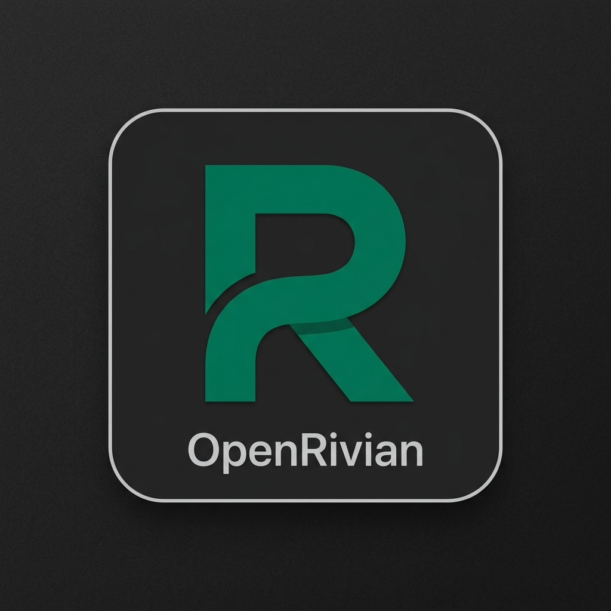

<div align="center">
  

  <h1>OpenRivian</h1>
  <p>An open source driver assistance system tailored for Rivian vehicles.</p>
</div>

---

## 🌲 What is OpenRivian?
OpenRivian is a specialized fork of [sunnypilot](https://github.com/sunnyhaibin/sunnypilot) and [ap-dev](https://github.com/adventurepilotdev/ap-dev) (which are downstream of [openpilot](https://github.com/commaai/openpilot)). It is explicitly engineered and optimized for Rivian vehicle platforms. OpenRivian introduces custom CAN logic, dynamic UI modifications, and native compiling tailored for Rivian integration on Comma hardware.

## ✨ Custom OpenRivian Features
OpenRivian introduces a modular microservice architecture designed to run alongside standard Comma processes without impacting safety or self-drive compute:
* **Local Web Dashboard**: A custom React/Vite local dashboard served natively from the Comma, providing rich visualizations of OpenRivian telemetry and stats.
* **MQTT Telemetry Bridge**: High-performance, low-priority background daemons (`cereal2mqtt`, `mqtt2params`) that safely bridge openpilot's native `cereal` sockets to a local MQTT broker (`mqttd`) for UI consumption.
* **API Integration Engine**: The `openriviand` daemon seamlessly handles the Rivian API token exchange and prepares the groundwork for routing and telemetry syncing.

## 🌿 Branch Architecture & CI/CD
OpenRivian relies on a heavily automated branching strategy and a strict CI/CD pipeline to ensure flawless compatibility with upstream updates.

### 1. `feature/*` Branches
All new development occurs here. When a developer pushes to a feature branch, GitHub Actions automatically run rigorous Python module tests and checks for priority resource safety (`os.nice(19)` enforcement). 

### 2. `dev-test` Branch (Integration & CI)
When a feature is ready, it is merged into `dev-test`. 
* GitHub Actions run a final battery of integration tests, module import verifications, and checks for graceful failure/fallback mechanisms.
* Nightly upstream updates from `clean` are also merged and injected into `dev-test` first.

### 3. `dev` Branch (Active Deployment)
This is the **active deployment branch**. It contains all OpenRivian-specific logic, UI hooks, and custom assets.
* **Protected by Automation:** The `dev` branch is *only* updated automatically by a fast-forward from GitHub Actions after `dev-test` passes all CI/CD integration tests.
* This is the branch you should use for active testing and development on your Comma device.

### 4. `clean` Branch
This is our **pristine mirror** branch. It tracks `adventurepilotdev/ap-dev` and syncs changes via a nightly GitHub Action. 
* **DO NOT** commit directly to this branch. 

### 5. `pre` Branch (Prebuilt)
This is our **lean, release-ready branch**.
* Designed specifically for the Comma 4, this branch is compiled natively and stripped of all raw C/C++ source code to save massive amounts of space.
* It utilizes the `prebuilt` flag to ensure near-instant first boot times.
* *Note:* This branch is generated on-demand using the `selfdrive/ui/openrivian/scripts/build_prebuilt.sh` script.

## 🚀 Installation & Usage
To install OpenRivian on your Comma device:
1. Connect to Wi-Fi.
2. When prompted for custom software URL, enter: `adwilson254/dev`
3. Enjoy the drive.

### Building the Prebuilt Release (`pre`)
If you want to strip your local Comma codebase and create the fast-booting `pre` branch, simply SSH into your Comma and execute:
```bash
bash selfdrive/ui/openrivian/scripts/build_prebuilt.sh
```

---

## 📜 Licensing
OpenRivian inherits the [MIT License](LICENSE) and includes original work from comma.ai and sunnypilot. 

> **THIS IS ALPHA QUALITY SOFTWARE FOR RESEARCH PURPOSES ONLY. THIS IS NOT A PRODUCT. YOU ARE RESPONSIBLE FOR COMPLYING WITH LOCAL LAWS AND REGULATIONS. NO WARRANTY EXPRESSED OR IMPLIED.**
